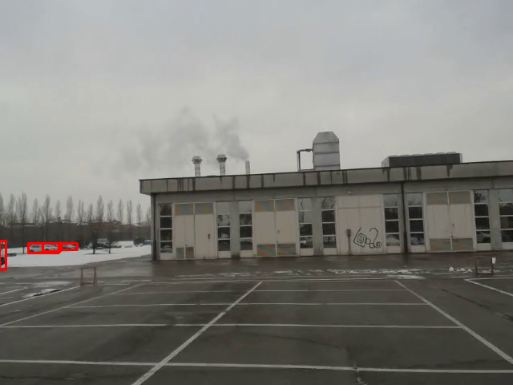

# Dataset generation

Simple tool to create a dataset from a collections of images using darknet supported networks for object detection. 

## How to build the project

```
git clone https://github.com/mive93/datasetGen
cd datasetGen
git submodule update --init --recursive
cd darknet/
```

Open the Makefile and set the following values to 1:

```
GPU=1
CUDNN=1
OPENCV=1
LIBSO=1
```

Then 

```
make -j4
cd ..
cp darknet/libdarknet.so .
```

Then open cfg/coco.data and change names to:
```
names = darknet/data/coco.names
```

Finally, download the weights of the used network, e.g. Yolov4

```
wget https://github.com/AlexeyAB/darknet/releases/download/darknet_yolo_v3_optimal/yolov4.weights
```

## How to create the images from a stream or video

The genImages script takes in input a stream or a video and extract images from it each ```s``` seconds.
It stores those images in a given folder. 

```
python genImages.py
```
Arguments:
```--input_stream INPUT_STREAM```:  RTSP stream or video path from wich to extract images
```--image_dir IMAGE_DIR```: folder where to store the images
```--s S```: interval of seconds to store images

## How to create the labels

The genDataset script will open all the images in a given folder and run a darknet model for object detection on that. 
The images will be displayed to screen with the given labels and the user will be able to:
- remove the undesired labels with a click (mouse left click) on the unwanted label.
- restore all the original labels in case of mistake (mouse right click).

The script will create both a folder with a txt file for each image in the darknet format and a txt file containing all the image paths (dataset.txt).

```
python genDataset.py
```
Arguments:
  - ```--dataset_location DATASET_LOCATION```: image to annotate folder path
  - ```--outdir OUTDIR```: folder where to write the labels
  - ```--weights WEIGHTS```: yolo weights path
  - ```--config_file CONFIG_FILE```: path to config file
  - ```--data_file DATA_FILE```: path to data file (e.g. coco.data)
  - ```--thresh THRESH```: remove detections with lower confidence

## How to check the correctness of the labels

checkLabels is a script to check the correctness of darknet format labels. 

```
python checkLabels.py
```
Arguments:
- ```--images_file IMAGES_FILE```: path to a txt file with all the paths of the images to check
- ```--labels_dir LABELS_DIR ```: folder where to find the labels


## Full pipeline


Given the demo video


<!-- <p align="center">
   -->
<!-- <p> -->


```
python genImages.py --s 10
```

The following images are saved:
<table>
  <tr>
    <td></td>
    <td></td>
    <td></td>
    <td></td>
  </tr>
</table>

On that we select the labels we think are correct. The generated labels can be found in img folder. 
```
python genDataset.py
```

Finally we check that eveything is in order.

```
python checkLabels.py
```

<table>
  <tr>
    <td></td>
    <td></td>
    <td></td>
    <td></td>
  </tr>
</table>


